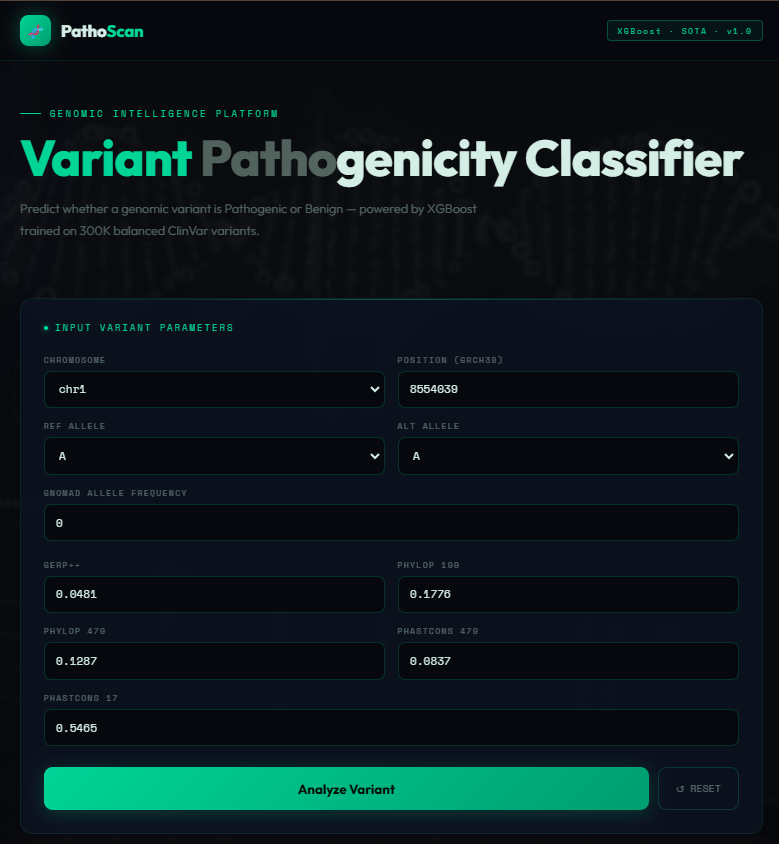
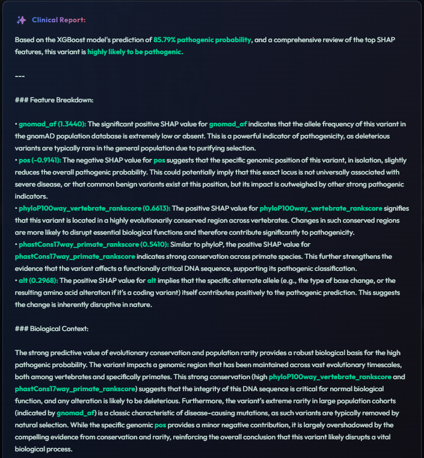
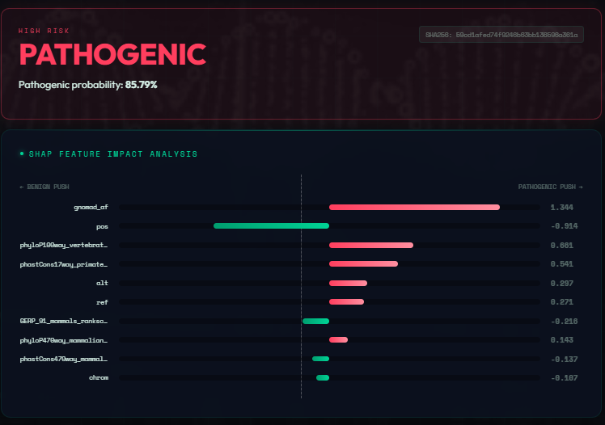

# 🧬 PathoScan — Clinical Genomic Variant Intelligence

> AI-powered system for **pathogenicity prediction of genomic variants** using XGBoost, SHAP explainability, and Gemini-based clinical insights.

---

## 🚀 Overview

PathoScan is a full-stack AI system that:
- Predicts whether a genetic variant is **Pathogenic or Benign**
- Explains predictions using **SHAP (Explainable AI)**
- Generates **clinical insights using Gemini AI**
- Provides an intuitive web-based interface for researchers and clinicians

---

## 🧠 Core Features

- ⚡ **High-performance ML model (XGBoost)**
- 🔍 **Explainable AI with SHAP**
- 🤖 **LLM-powered clinical interpretation (Gemini)**
- 🌐 **Interactive frontend dashboard**
- 📊 **Feature-level importance visualization**

---

## 🧬 Data Preprocessing Pipeline

PathoScan leverages a **multi-stage genomic data pipeline** to transform raw datasets into structured features suitable for ML models.

---

### 🧬 1. Data Sources

PathoScan integrates multiple high-quality genomic databases:

- **ClinVar** – Clinical annotations of variants  
- **gnomAD** – Population allele frequencies  
- **dbNSFP** – Functional prediction scores (CADD, REVEL)  
- **GRCh38** – Reference human genome  

📥 Dataset Source:  
https://ftp.ncbi.nlm.nih.gov/

---

### ⚙️ 2. ClinVar Data Cleaning

Raw ClinVar data is curated into a reliable training dataset.

#### 🔹 Filtering
- Retain only **Single Nucleotide Variants (SNVs)**
- Align variants to **GRCh38**

#### 🔹 Label Standardization
- Pathogenic + Likely pathogenic → **Pathogenic**
- Benign + Likely benign → **Benign**

#### 🔹 Data Cleaning
- Remove missing values  
- Remove invalid alleles (`na`, `-`)

#### 🔹 Feature Extraction
- `chrom` – Chromosome  
- `pos` – Position  
- `ref` – Reference allele  
- `alt` – Alternate allele  

#### 🔹 Unique Identifier
variant_id = chrom_pos_ref_alt
🌍 3. gnomAD Processing

Provides population-level signals for rarity detection.

🔹 Extract:
Allele Frequency (gnomad_af)
Allele Count (AC)
Total Alleles (AN)
🔹 Output:
Stored in Parquet format
Includes variant_id for merging
🔗 4. Data Integration
Perform left join (ClinVar ← gnomAD)
Missing values:
gnomad_af = 0.0
🧠 5. dbNSFP Enrichment

Adds biological intelligence to predictions.

🔹 Features:
CADD_phred – Deleteriousness score
REVEL_score – Pathogenicity predictor
🔹 Processing:
Chunk-based parsing (10GB+ files)
Match using:
chrom:pos:ref:alt
🧬 6. Reference Genome (GRCh38)
Parse FASTA files
Extract sequences:
Chromosomes 1–22
X, Y
chrM
Store as Parquet for fast access
⚠️ Data Leakage (Critical ML Concept)
📌 What is Data Leakage?

Data leakage occurs when information from outside training data (like test data or future data) is used during training.

❌ Why It’s Dangerous
Model appears highly accurate during testing
But fails in real-world scenarios
🛡️ How PathoScan Prevents It
Strict train/test separation
Deduplication of variants
Feature generation only from available biological signals
No future or label-derived features used
🧠 Model Architecture
Model: XGBoost Classifier
Task: Binary classification (Pathogenic vs Benign)
Input: Genomic + conservation + frequency features
Output: Probability score
📊 Explainability (SHAP)

PathoScan uses SHAP to explain predictions:

Feature contribution per prediction
Positive/negative impact visualization
Ranked feature importance
🖥️ Application Screens
## 📊 Dashboard

  

## 📈 SHAP Explanation

  

## 🧾 Output

  

